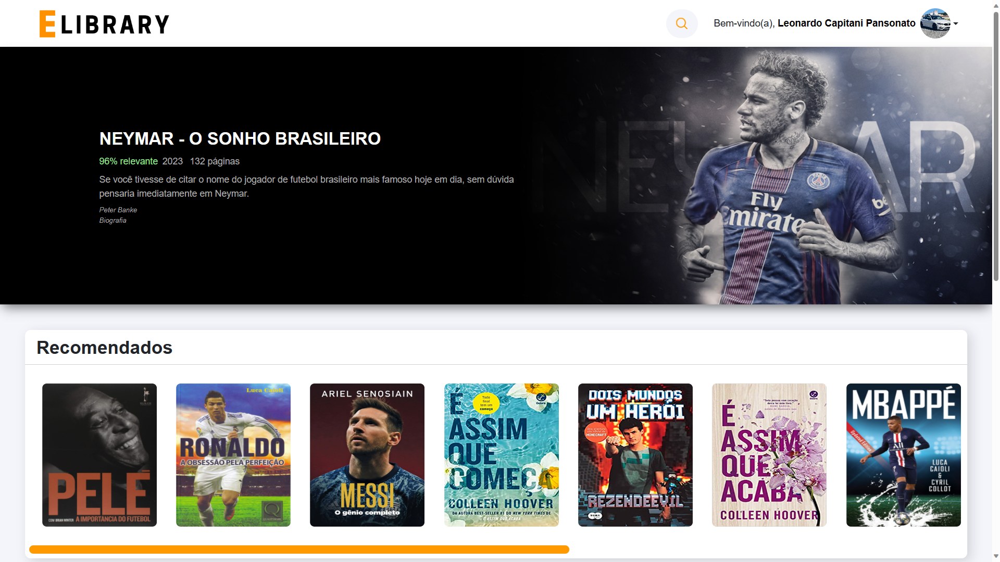
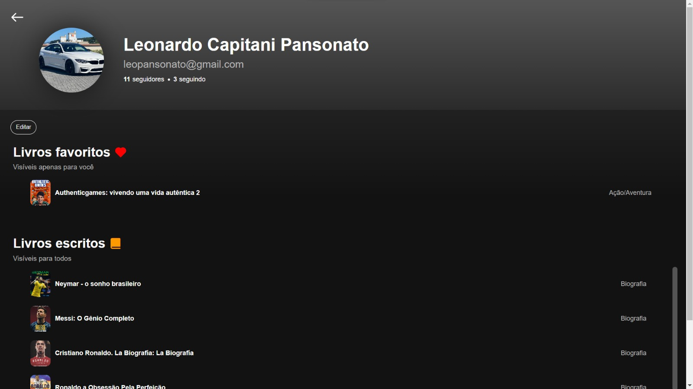

# LivroFlix

## About

`LivroFLix` is a web application that allows users to explore, search, and read books online. It offers a wide variety of books in different categories.

## Features

- Search books by title, author, or category
- View book details, including synopsis
- Read all books you want
- Customize your own profile
- Follow your favorite writers
- Save books

## Technologies Used

- HTML
- CSS
- PHP
- JavaScript
- XAMPP
- MySQL

## Requirements

- PHP 7 or higher installed on your development environment.
- XAMPP installed with Apache server and MySQL activated.

## Database Configuration

1. Import the `livro.sql` file located in the main folder to create the database structure.

## How to Start the Project

1. Download or clone the repository to the root directory of your local web server (`htdocs` in the case of XAMPP).

2. Start XAMPP and ensure that the Apache server and MySQL are running.

3. Open your browser and access `http://localhost/TCC` to access the application.

## Future Plans
- Read later
- Reader reviews
- Continue reading
- Write your book

## Contributions

Contributions are welcome! If you find issues or have suggestions for improvements, feel free to open an issue or submit a pull request.

## Contact

If you have any questions or feedback, feel free to contact at [leopansonato@gmail.com](mailto:leopansonato@gmail.com).

   

# Screenshots

